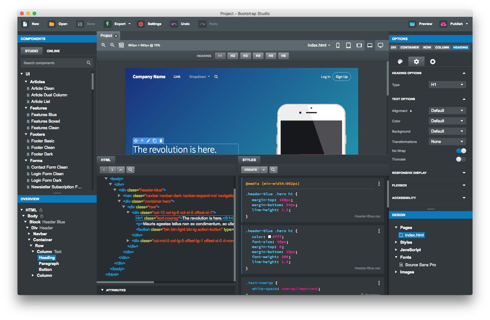
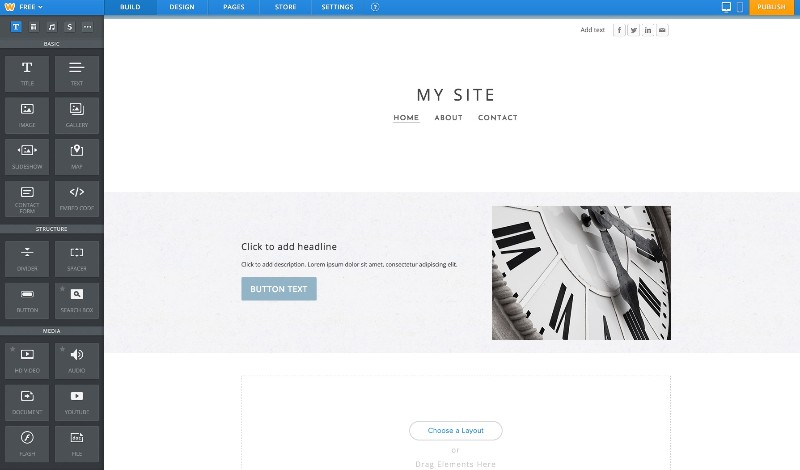

OSD600 Week Six Deliverable

When we were given the instructions to search, locate and eventually implement fixes or upgrades to Mozilla’s Thimble or Brackets, I found what perhaps was the most challenging enhancement I could possible implement. Suggested here by the professor, and assigned to myself at my own request, the user interface discussion can be found [here](https://github.com/mozilla/brackets/issues/594). Like any good IDE, developers utilize space and workflows to be the most efficient they can, often relying on key mappings and high resolution monitors to provide the most content to their view with ease.

The desktop version of Adobe’s Brackets includes multiple toolbars, which are accessible to the left and right of the editing window -thus providing a simplistic way of accessing commonly used tools, setting configurations and relevant functions for your current project. This is not the case on the Web version, which does not sport said toolbar except for on top of the editor, limiting some of the settings and functional elements to be hidden behind menus. The proposal I agree is very useful for the development of Mozilla’s brackets fork, allowing it to become a much more utilitarian friendly online editor while also providing a smooth and clutter free experience for the beginner and hobbyist.

With this proposed enhancement to the interface, the question of what tools, functions or utilities would be placed in the empty space there. As you can see from the image below of the current Thimble editor, there’s quite a bit of space that we can augment to utilize a responsive toolbar. After doing research related to web development tools, including Adobe’s Brackets, JetBrains’ WebStorm, Microsoft’s Visual Studio Community, and Firefox’s developer tools.

# Proposed Features

For my first proposal of features which may be added to that space without cluttering the user interface, I focused on augmenting Brimble (Brackets + Thimble) accessible features to be more advantageous to the developer’s requirements, thus allowing them to use utilize Thimble beyond the standard learning platform which is currently proposed. I’m aware that development of related features is also being in discussion now, which is why I claim this as my first set of proposed features for that space.

## Quick Settings

Access to the Editor’s settings, including tab spacing, typeset, syntax highlighting styles, and plugin support. This would tie in with the originally implemented preferences manager, allowing the user to custom tailor their experience on their development machine.This would be responsive, my suggestion on how to best utilize the space is to have three different width classes which would display the settings in the following manners:

1. Icon Text: Value
2. Text: Value
3. Icon: Value

Using three different display manners would allow the application to determine which is best to use for the space, thus introducing a dynamic display which could adapt to different widths without changing the familiarity of the layout and icons.

## Code Snippets / Templates

Following similar to XCode’s UI Creator, this area could house drag-drop templates for basic HTML code, with the option to extend with framework classes and various other snippets that may be useful in the future. This would allow Thimble to be more accessible to newer developers, while also providing good web standards. Furthermore, it may benefit the average developer looking to utilize Thimble beyond just a learning environment, and instead use it as a basic test environment for their code. Examples of this can be found in the following sites and applications:

### Xcode

<!--  Source: [https://developer.apple.com/xcode/interface-builder](https://developer.apple.com/xcode/interface-builder) -->

### Bootstrap Studio

 Source: https://bootstrapstudio.io/

### Weebly

 Source: http://www.getspokal.com/
