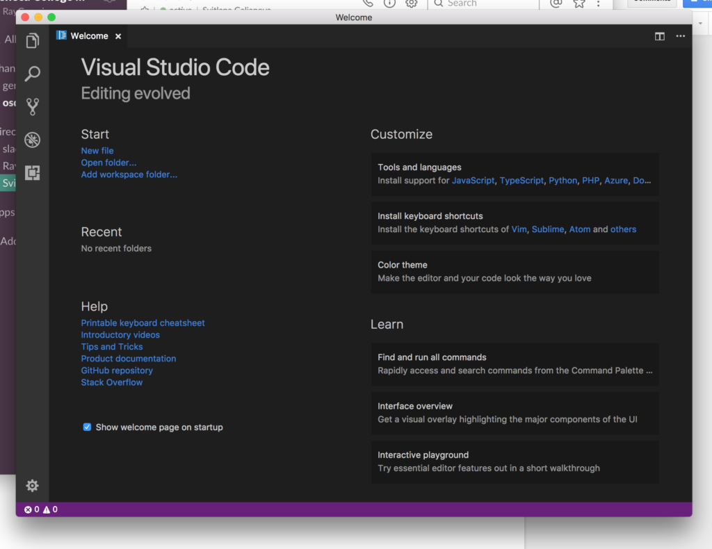

## On MacOS High Sierra

Building Visual Studio Code is quite the interesting process, mostly because the dependencies differ in obtainability between operating systems. For this article, I’m going through the process on MacOS High Sierra since it will be primary development machine for upcoming bug fixes, code improvements and contributions to Microsoft’s Visual Studio Code.

## Set Up

Visual Studio Code requires the following prerequisites, Git, NodeJS, Python, GCC, Make, and Yarn. Of all the dependencies for this project, Yarn required me to use homebrew for installation, which is supposed to be as simple as `brew install yarn` if you have it configured correctly. I didn’t, so following the excellent single step found here https://brew.sh helped set up and configure Homebrew on MacOS. Finally, running through the CLI `yarn` will install all other dependencies over the course of an hour depending on your internet connection.

## Building & Launching A Development Instance of Code

After installing all dependencies, the setup guide simply says to run `yarn run watch` which will compile and build Code. From there, if you see no errors or warnings you’re good to proceed!

 Launching via `./scripts/code.sh` for Linux or MacOS, or `./scripts/code.bat` results in the final compiled application executing!

## Going Forward

Right now, I’m looking into bugs relating to Visual Studio Code’s Color Picker, which is a front-end developers best friend when it comes to writing CSS Framework overrides and theme templates. Currently, I’m exploring the following potential bugs:

- [[REQUEST] Color Picker support from command pallet](https://github.com/Microsoft/vscode/issues/33853)
- [Provide different settings for color picker and that square showing color](https://github.com/Microsoft/vscode/issues/34341)
- [Color picker: dismissing the picker with ESC should not apply changes](https://github.com/Microsoft/vscode/issues/31641)

One pattern that I’m starting to discover among many of the bugs reported, is a lack of administration among the various domains. Bugs have been fixed, merged, etc, the tickets themselves remain open and untouched. More research is being conducted to discover bugs which line up with my interests and end goals, worst case being moving to a different domain of the project, or trying to find a different open source project to contribute to such as Angular Material https://material.angular.io.
