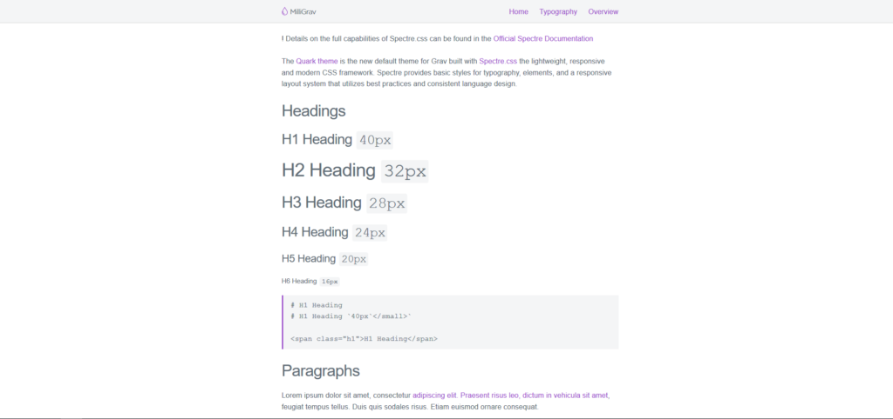
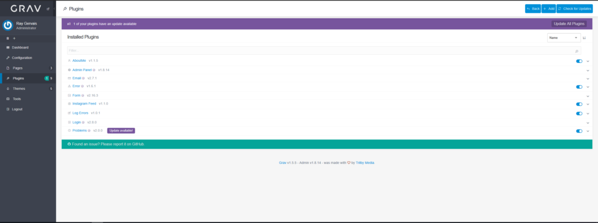

_Some Thoughts from a former WordPress User_

As a developer, I find a lot of the ‘magical’ moments occurring from discovering new technology, platforms and applications which challenge the norm, or go beyond the tried and true to carve a path both familiar and unfamiliar to the user. While reading either Reddit or HackerNew (cannot remember origin sorry!), I saw a comment comparing popular CMS platforms to a modern abstract interpretation: Flat-File based CMS; namely, GRAV. I decided that I’d take a look. I wanted this look to be brief, similar to how one may compare this look to a spike in a sprint, where some time is spent identifying the viability of investing further efforts and time into the task.

I should preface this by explaining what is a Flat-file based CMS, and why it caught my attention compared to the hundreds of offerings to your typical LAMP stack. CMS Wire described a Flat-file CMS platform as:

> [A flat-file CMS is] a platform that requires no database. Instead, it queries its data from a set of text files.
>
> Because there’s no database involved, a flat-file CMS is supremely easy to deploy and super lightweight in terms of size. Some flat-file CMS even run on as little as five core files.
>
> Flat-file content management systems allow for heightened speed, simplicity, mobility and security. Plus, they are an approachable solution for the less technical and underfunded.
>
> Here are the key benefits of a flat-file CMS:
>
> **Quick Deployment:** installation can be done with an FTP client alone.  
> **Site Speed:** thanks to the absence of database queries, sites load a lot faster.  
> **Lightweight:** flat-file platforms are typically very small in size.
>
> **Mobile:** because they’re so small in size and because they have no databases, moving flat-file projects from server to server is a breeze.

The lack of database I found unique since this opens up potential performance benefits and NoSQL styled archiving through your own file storage; I’m a sucker for those which oppose the expected, so I was all in for trying this CMS type out. I decided to approach this overview similar to a user, instead of a developer who’d be integrating API’s and various other snippets into their project, to better understand how it compares to the average user of WordPress which powers the current site you are reading this on.

## Installation and Setup

Every good developer follows the README and instructions, after attempting all implementation ideas first. I was no better, having overlooked the three quick-install directions for this already portable application. They are:

1. Download either the [Grav core](https://github.com/getgrav/grav/releases/download/1.5.5/grav-v1.5.5.zip) or [Grav core + Admin plugin](https://github.com/getgrav/grav/releases/download/1.5.5/grav-admin-v1.5.5.zip) installation package
2. Extract the **zip file** into your webroot
3. Point your browser at your local webserver: http://yoursite.com

Unzipped File System (default)

I downloaded the Core and Admin plugin package, and encountered two issues within seconds of attempting step three, they were:

1. Renaming the folder after extracting would have been a better idea than moving all ‘public’ files outside the folder (essentially moving the folder structure up a tree node), because one of the hidden files that I neglected the first time which was critical was .htaccess.
2. Tested in my GoDaddy Playground domain (the-developers-playground.ca/grav/), I had to enable a few PHP modules and versions which I’m led to believe are commonly enabled by default. Not an issue, but not easily accessible to those navigating around various hosting provider’s interfaces and default configurations.

Once fixing those two, the setup process for creating your website and administrative account was smooth and quick. When finished, you’ll see the admin interface similar to this which alludes to a successful setup!

Default Administration Dashboard

## Features

_I’m currently playing with_ [_Grav_](http://getgrav.org) _v1.5.5, and version v1.8.14 of the Admin plugin._

### Themes

What are the available themes like for GRAV? Well, if I had to summarize for those more aware of Drupal, WordPress and ModX's offerings: stark. This is expected, I have no arguments or expectations about the available set being so low; it’s a brand new platform without the world-wide recognition of WordPress and other mature Content management systems which drives adoption and addon creation. At the time of writing this, there are 102 themes supported ‘officially’ in the addons portal -I am sure there is at least this amount in unofficial and unreleased themes as well scattered throughout GitHub. A few characteristics of the official themes that I’ve noticed are:

1. Some are ports are popular themes and frameworks from other CMS offerings
2. There are bountiful amounts of Foundation, Bootstrap and Bulma powered themes
3. Many of these themes are geared towards three mediums:
   1. Blogs
   2. Websites
   3. Dynamic Resumes and Portfolios

MilliGRAV theme on the-developers-playground.ca/grav/

I certainly don’t have the qualifications to judge CMS themes, but I can say that if you are not in the mood of creating your own, there are plenty to choose from and extend as needed - You’ll see below that I chose one that I hope to extend into a dark theme if time and ambitions permit, but that’s another story for a different day. It appears new themes are published and updated weekly, which I think implies a growing ecosystem. I tried out the following themes, and currently have the Developers Playground instance  using the very last in the list below:

- Chalk - [http://chalk.paulmassendari.com/](http://chalk.paulmassendari.com/)
- Ceevee - [http://demo.getgrav.org/ceevee-skeleton](http://demo.getgrav.org/ceevee-skeleton)
- Hola - [http://demo.devlom.com/grav/hola/](http://demo.devlom.com/grav/hola/)
- Landed - [https://behold.metamotive.co.nz/landed](https://behold.metamotive.co.nz/landed)
- Bulma Portfolio (Based on the Bulma CSS Framework) - [https://github.com/JohnMica/grav-theme-bulma-portfolio](https://github.com/JohnMica/grav-theme-bulma-portfolio)
- MilliGRAV (based on the Milligram Minimal CSS Framework)

You can see the official ‘skeletons’ over here [https://getgrav.org/downloads/skeletons](https://getgrav.org/downloads/skeletons), which provide a quick-start template and setup for various mediums. A nice addition for those unsure how they want to use GRAV just yet.

### Plugins

If I wanted to be snarky, I’d say that I’m surprised there are still PHP developers in 2018. That would be ignorance and bias for the record, since PHP is still quite the lucrative language to know; almost every non .NET blog is powered by LAMP stacks even to this day -somewhere around 60% of the public internet is powered by PHP and WordPress, right? The saying goes something like that at least. That also means, that there should be a plugin ecosystem growing with GRAV, right? At the time of writing this article, there are 270 plugins in the known GRAV community. These wonderful modules include:

- YouTube
- Widgets
- Twitch
- TinyMCE Editor
- TinySEO
- Ratings
- SQLite
- Slack
- Smartypants
- Music Card
- LDAP
- Lazy Loader
- Twitter
- GitHub

The list goes on and on, but I listed a few that I found intriguing. I plan on playing with a few and making the currently static root for the-developers-playground.ca into a GRAV site, which will link to my experiments and work while utilizing some of the plugins.

### Portability & Git Sync

So, why did I find intrigue in a Database-less CMS? Well portability for one. If all you need is Nginx or Apache with the correct (and standardized) modules enabled, you can have everything up and running with no other dependencies or services to concern yourself over. It means that I can develop locally, and know that when I update the production side all of the data will be the same, alongside configurations, styles, and behaviors. On top of those benefits, it also meant that I could version control not just the platform, but the data using typical developer semantics.

There are multiple workflows which allow for version control of content, similar to Ghost and Jerkyll which caught my attention. If you want lightweight, you can version control the /user/pages folder alone, and even utilize a plugin such as Git Sync to automatically pick up webhooks from your favorite Git Platform upon each commit. That’s one way to get those green squares, right? I see this incredibly advantageous because it allows for a much more flexible system which doesn’t dictate how items are versioned and stored, and instead treats the overall platform and it’s content similar to how a Unix system would; everything is a file.

You can find all the details for utilization, development, and contributions over here: [https://github.com/trilbymedia/grav-plugin-git-sync](https://github.com/trilbymedia/grav-plugin-git-sync)

## Closing Comments

Once issue I noticed quite frequent in both the themes and plugins, is the reliance on the [insert pitchfork.gif] JQuery library for the vast majority of the UI heavy lifting. Moreso, the documentation and Discord channel appears to be quite helpful, so first impressions lead towards a developer-friendly environment where you can build out your theme and plugins when the community ones don’t fit your needs.

I noticed that many of the themes can be overwritten safely (meaning you can update and not break your custom styling), which gave me the sense that there’s plenty of foundation to work off of instead of starting from a blank slate. I like that, because I really enjoyed the aesthetic of MilliGRAV, but longed for a darker theme such as my typical website. I may experiment porting my color theme over and seeing how well that goes in my next experiment with GRAV.

All-in-all, I really enjoyed doing a quick sporadic walkthrough of this content management system and can see myself using it in the future when I want to migrate away from WordPress for clients and myself; perhaps even start clients there if  they have less requirements and needs. I even see it coming up even sooner for static sites that need an update, and CMS integration such as rayzplace.ca which is in dire need of a refresh. GRAV would fit perfectly there.

## Bonus!

I decided while reviewing the article to build out two Dockerfiles which revolve around GRAV, one being a templated default started that you can run locally, and the other which copies from your custom GRAV directory to an apache server for development and testing. Both employ using port 8080, and could be configured for HTTPS if you want to further extend them! Default Grav (non-persistence) + Admin Dockerfile provided by the GRAV developers: https://github.com/getgrav/docker-grav

_After further investigation, it appears the link above also describes a workflow similar to what I was going to suggest utilizing volumes. I'm removing my link and advocating theirs, which works._

## References

https://www.cmswire.com/digital-experience/15-flat-file-cms-options-for-lean-website-building/

https://getgrav.org/
