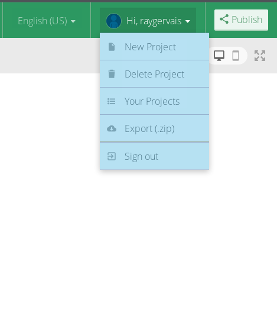

OSD600 Assignment One Deliverable

In the last week of January I posted about setting up a local instance of Thimble, an online editor which supported the learning of HTML, CSS and JavaScript. This project allowed for educators and hobbyists alike to program, and demonstrate their code with live previews in the same window without ever having to leave the editor. Due to the learning nature of Thimble’s developers and maintainers ,who advocate allowing contributions from students as much as professionals alike, the project has also become an educational tool of it’s own for the open source developer.

My issue (which can be found [here](https://github.com/mozilla/thimble.mozilla.org/issues/1635)), made drop down links much more difficult to click than they should have been. This decreased usability and accessibility of the options menu, coincidentally also breaking WCAG 2.0 AA compliance, since the links provided no signs of interaction or feedback to the end user unless selected at just the right spot.

After debating on two possible implementations, one being a CSS change and the other being a JavaScript listener for the `<li>‘s <a>` element, the former was decided upon. Fixing the CSS would involve modification of the userbar.less file, which would first imply I had to learn the Less syntax required for this project. Less is described by the official website as the following:

> Less is a CSS pre-processor, meaning that it extends the CSS language, adding features that allow variables, mixins, functions and many other techniques that allow you to make CSS that is more maintainable, themable and extendable.

This technology allowed for a cleaner cascading style sheet, which I grew to appreciate as I looked through the file in attempts to learn the coding conventions and syntax required. After using Sass for over a year, I can see where Less had showcased advantages over its competitor, and unique disadvantages such as requiring NodeJS to be installed and functional on your workstation for compilation to .CSS. I much prefer having Ruby, Sass’s processing engine in contrast simply because  I found it be more programmable and resource efficient. My modification allowed for a much more accessible menu, which can be seen below - Note that the menu isn’t blue, this is simply a tool in my workstation for isolating and highlighting the style classes I’m working with now.

With a little testing on my local machine to ensure that this did not break other sections of the thimble’s interface, I proposed the following changes in the form of a [pull request](https://github.com/mozilla/thimble.mozilla.org/pull/1697). This issue was a simple CSS change, with the final diff looking like the following:

At the time of writing this blog, my pull request was landed by a maintainer, who after a few requested changes to the syntax, was content with my small contribution. This introduction to bug fixing, along with code navigating and learning how thimble works was quite the adventure, and I know for certain that it will not be my last time visiting thimble’s repository for contributions and updates.
