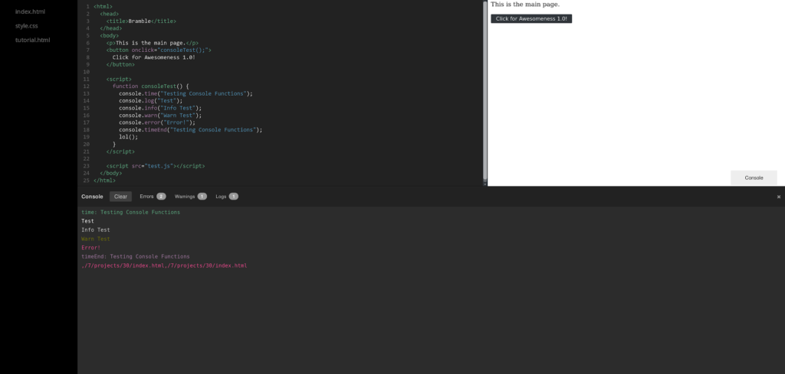
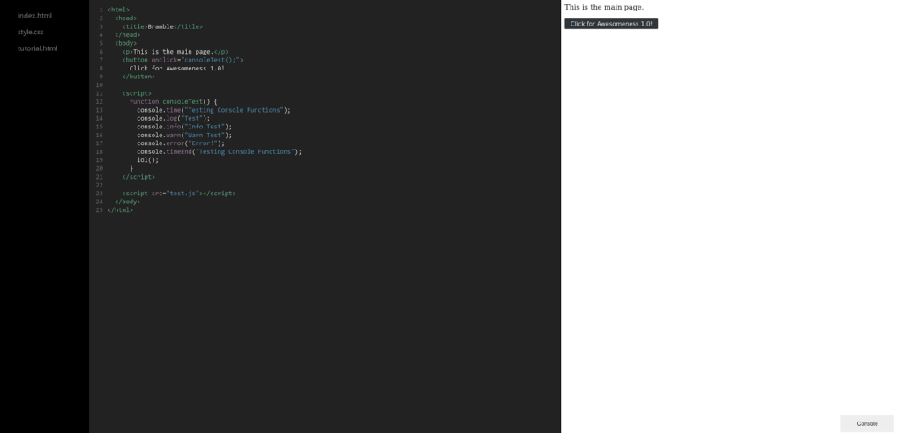
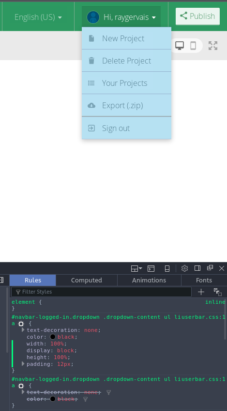
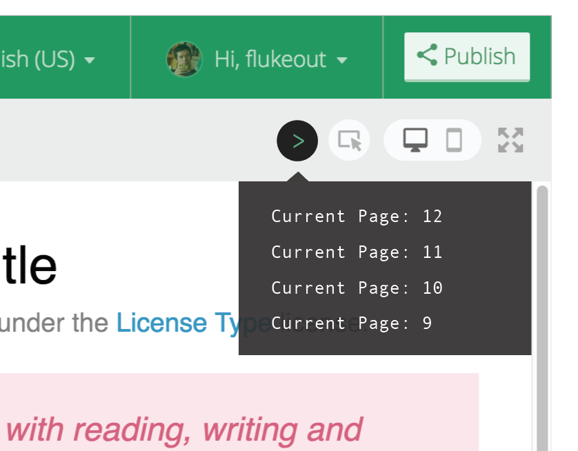
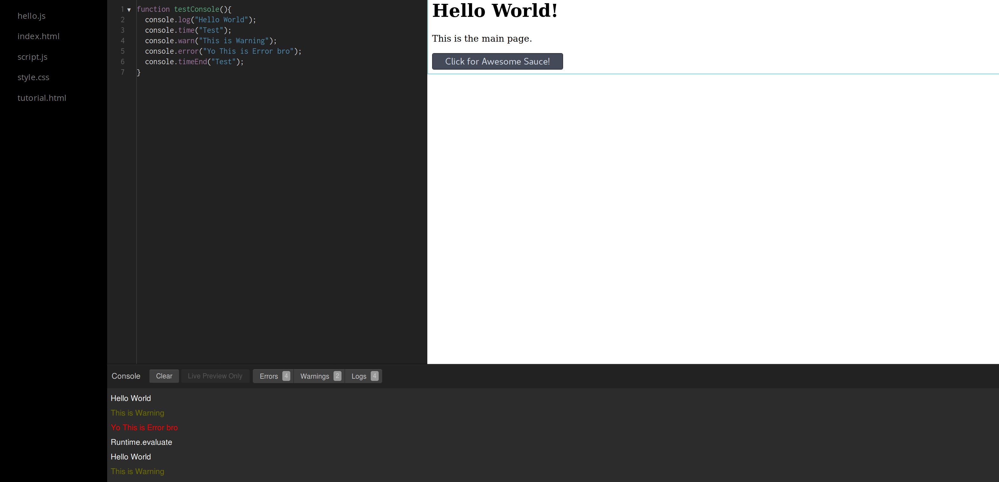
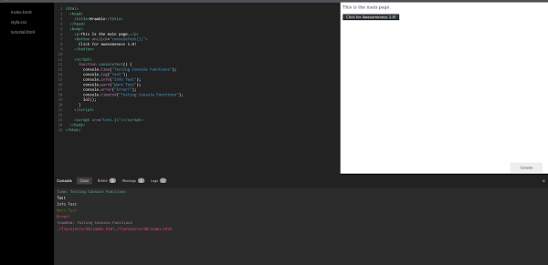

A OSD600 Contribution Overview

This post will be one of my last related to this semester, specifically to OSD600 which has seen the class learning quite a bit about Open Source web technologies; contributing to Mozilla’s Thimble in doing so. More on such topics can be found here and there. Though I’ve mentioned my contributions before, -even sometimes becoming the main focus of an article, I thought this post would show how the console works at the current time. As of this moment, it would appear that a good majority of the first release version is complete, with UX / UI being the last remaining items that are being taken care of by yours truly, or [Luke](https://github.com/flukeout) who’s a fantastic graphic designer working for Mozilla.

# Introduction

This console has been a feature request for educators and hobbyists, enabling them a cleaner method of instructing or developing JavaScript driven web pages with ease. Soon, their request will be accessible within Thimble directly without any hidden settings, or complicated setup.

I suppose, being honest, there’s not too much reason to be as excited or as proud as I am -but to that, I say that this has been quite the learning experience; full of new platforms and practices that I had never encountered before. I’m damn proud of what I was able to learn with the instructions of Dave, Luke, Gideon and various others this semester, and equally as proud to say that I contributed to Mozilla in a way which will help benefit users in new ways. With honesty out of the way, onto the feature set of V1!

**Important Note, all user interface & interactions presented below are not finalized** **and may change before release**.

# Resizable Containers

Like every good text editor, all elements and windows should be resizable to accommodate a wide variety of screen sizes, user preferences, and workflows. Thimble has been no different, which meant that this console too, had to be resizable. This is handled by a resizing plugin found throughout the project, which has made all the difference it seems when it comes to customizability and accessibility in the various toolings.

# Console.\* Functions

What good would a console be if it only displayed your shortcomings? This console goes beyond that, allowing for one to utilize standard console functions such as log, warn, error, time, timeEnd, clear, and assert. Other functions perhaps will be added before V1.1 ;).

# Error Handling

When engulfed in a spontaneous 10-hour coding session, it’s easy for the split of a finger to cause typos, syntax errors, and inconsistencies across variable references all of which, resulting in an error being produced. In the console, the error is displayed similar to the standard stacktrace found throughout common IDEs & debugger tools. Below, you’ll see the current implementation, which is still being fleshed out.

# Toggable Context

When starting returning to a project, or starting fresh with a blank template, the console does not appear. Instead, you’re presented with a toggle found in the bottom right which displays the console. Likewise, for those unaware of the toggle, the console automatically appears when a console-related function is called; convenient I’d say. If the console is instead unwanted, closing it with the close button will disallow the console to reappear until the user reopens the device.

# Getting to This Point

It’s amazing how, from the very start of a semester how far you can go down the wormhole, effectively specializing yourself in one of the vast code pools which make up Thimble. I would have never guessed from my first contribution that I’d be working on a console which interacts with the injected back-end code, overriding functions with replaced logic that caters to how the user would interact with the basic console. Likewise my peers, roommate even, have discovered a section of the code base that no one else in the class had. In my case, here is how I got to this point.

## Contribution 1: Issue #1635

This bug made selecting a link on the user’s dropdown menu borderline impossible at times to register.  Luke’s description of the issue was:

The items in the dropdown menus only work if you click the text of the item, and not the entire length and height of the highlighted item when you hover.

[Issue](https://github.com/mozilla/thimble.mozilla.org/issues/1635)

[Pull Request](https://github.com/mozilla/thimble.mozilla.org/pull/1697)

Essentially, this was a CSS fix, which resulted in me adding a few attributes to the \`a\` links which would fill out the list item object. A slight detour, was that when I say CSS, I mean LESS, an extension of CSS which is compiled into standard stylesheets. Having used SASS before, LESS wasn’t overly alien in syntax.

## Contribution 2 & 3: Issue #1675 (Back End)

This was more of an enhancement, which Luke described as:

When writing JS, using console.log() to check in on variable values is really handy. Opening dev tools while using thimble isn't a good solution because the screen gets really crowded. Is there a way to intercept console.log() calls and display them in Thimble? Any other solutions, can we add support for a "thimble.log" method? 

[Issue](https://github.com/mozilla/thimble.mozilla.org/issues/1675)

[Pull Request](https://github.com/mozilla/brackets/pull/624)

These two contributions oversaw the development of the back end, which would intercept and handle the console-related functions that would eventually route said function data into the user interface. When Dave first discussed with a all-so ignorant young developer (me!), I figured this would be cakewalk; simplistic. Within the first week, I probably inquired half a dozen times via email or the Issue page itself to figure out where to start. It was evident to everyone except myself, I was in over my head.

Turns out to a inexperienced young developer such as myself, that Thimble operated within multiple iframes, each passing data asynchronously through dedicated functions found in PostMessageTransport.js and the various extensions. This meant, that 1) I had begun working in the wrong code base already, and 2) was completely lost as to how one overrides window functions. Before this class, my knowledge of modern JavaScript was limited, fragile even.

After Dave got me on the right track, by the end of the pull request I had changed 90% of all the code that this excited developer was trying to contribute at least a dozen times. These changes were all warranted, such as eliminating repeating patterns which should become their own function, or stylistic changes which would enable the new code to sit among the rest without standing out.

Why did this span two contribution periods for the class? Well avid reader, because the second period was getting the system to communicate with each other, and the third being the optimizations, extensions and testing of said functions so that the fourth contribution would consist of the user interface alone without too much backend work. The final commit count before the merge was 25 commits, which interestly spanned 71 lines being added and 4 being removed.

## Contribution 4: Issue #1675 (Front End)

The final stage of the console implementation was creating the interface, which I was recommended to port from a Brackets plugin. I took the later option, which would in turn endorse Dave’s lesson of ‘good programmers are lazy’; well said sir. Well said. As I started porting the extension, it dawned on me that quite a bit would be redone to make it accommodate Thimble’s interface which differed heavily in contrast to Brackets -it’s forked base. Furthermore, many of the ‘features’ had to be evaluated since they followed a workflow which did not accommodate the standard style that Thimble presented. You can see a before & after I took a crack at the interface below, with Luke’s input as well thrown into the mix. It’s not complete, but I think it’s a step in the right direction.

### Before

### After

# Conclusion

To conclude, as I said previously, I’ve learned a lot. My peers and I have learned from those with decades of experience in the open source world; those who have helped pave the direction of many open source projects. Likewise, the code review and exposure to different toolings had enabled me to understand how Thimble’s code base -a project built on top of a plethora of other open source projects, looks and interacts as if a single developer coded every line. Learning contribution techniques specifically relating to Mozilla’s practices has also helped future proof our skill sets -that is if you share a similar belief; Mozilla’s developments and standards being the ideal technological standard for open source developers. If you’ve made it this far, I hope you enjoyed the read and get a chance to try out the first implementation of the console in Thimble.
