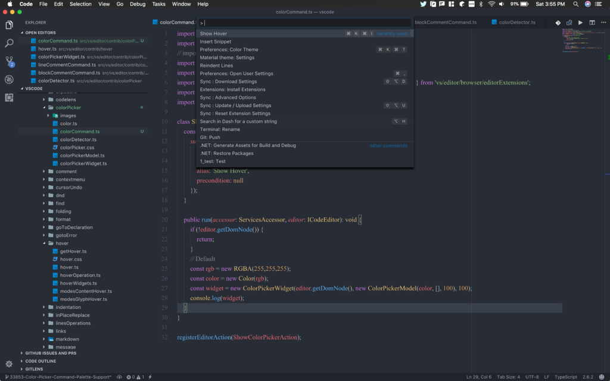
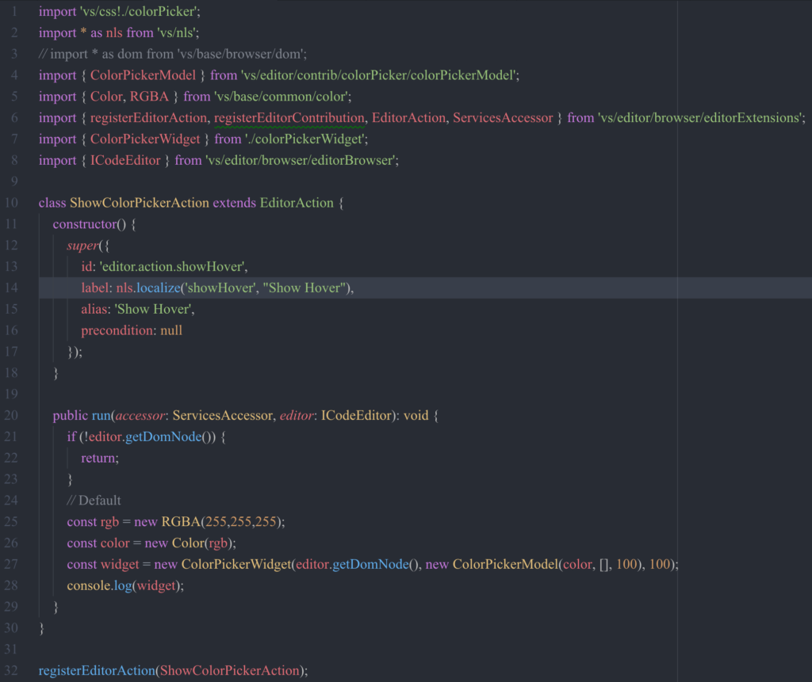

_An OSD700 Contribution Update_

Interesting concept, it’s a very surreal experience to explore and work on a project while using said project as the tool for development and exploration.

For a good part of the weekend, I’ve put aside time to look into how Visual Studio Code handles and manages the Command Panel, a tool / extension which I use daily for accessing various extension actions, configurations, and accessing files. The reason for trying to undercover the goldmine which is le Command Panel can be found in my attempt to add a color picker toggle to the list, a work in progress pull request can be found [here](https://github.com/Microsoft/vscode/pull/42255").

[](http://raygervais.ca/wp-content/uploads/2018/01/Screen-Shot-2018-01-27-at-3.55.53-PM.png)

## Attempt #1

My first attempt towards adding a command to the command panel was based off of how the comment extension accessed the panel. Later I would be pointed to a better example which I address in Attempt #2. In this attempt, I tried to create a wrapper which would expose the ColorPickerWidget class to the command panel, similar to how it is done [here](https://github.com/Microsoft/vscode/blob/master/src/vs/editor/contrib/comment/comment.ts#L16).

The idea at first made sense, till I realized that the implementation of CommentLineAction was directed to manipulation of the code close to the cursor. Furthermore, I didn’t need the kbOptions related scope in this case, since the original intent is simply to toggle a Color Picker through the command panel. I should have kept the code as an example here of what Attempt #1 looked like, but I had reverted back to the branch’s version prior to writing this post.

## Attempt #2

After much research and discussion over the [VSCode Slack Channel](https://vscode-dev-community.slack.com), I came to the conclusion that the first attempt should be redone using a better reference: `hover.ts`, which compared to `comment.ts`, provided a much better context. Thanks to Eric Amodio (Creator GitLens) for the tip there!

[](http://raygervais.ca/wp-content/uploads/2018/01/Screen-Shot-2018-01-27-at-3.52.11-PM.png)

Through this process of trial and error, I learned the basics of how the command panel worked: How commands and context are loaded into its elasticsearch-esque data-store, how said commands call different scoped functions and contexts, and how to add my own command into the mix!

## Putting EditorActions (Commands) into the Command Panel

A command you see in the panel is really an extension of the abstract class EditorAction, which extends [`EditorCommand`](https://github.com/Microsoft/vscode/blob/master/src/vs/editor/browser/editorExtensions.ts#168). This extension allows for one to program the context of how the implemented run command, contexts, editor-permissions, and keychords while providing a type inferred structure which is compatible with the original EditorCommand interface.

You can see in the snippet of code linking to my second attempt, the super call in the constructor handles creating a `IActionOptions` object, which is an extension of the abstract class `ICommandOptions`. It is this portion of the object which is placed in the Command Panel to provide context, labels, translation and scope. The Comment extension `~/src/vs/editor/contrib/comment.ts` shows the alternative way of handling the `IActionOptions`, which you can see below. I prefer this method due to a much cleaner and easier to read since the scope does not include the functionality, but the command alone.

The final part is to call `registerEditorAction` which is imported from `~/src/vs/editor/browser/editorExtensions` as you may have guessed. The total amount of imports from that file derives directly with the context and actions that your command will need or perform, below I’ve listed the common ones which I encountered when looking through the comment, and hover extensions.

### EditorCommand

Location: [Github Link](https://github.com/Microsoft/vscode/blob/master/src/vs/editor/browser/editorExtensions.ts#L100) The function which extends `Command`, and provides the inner-architecture required to bind and remove actions to the command panel. It’s public functions are:

bindToContribution(controllerGetter: (editor: ICodeEditor) => T): EditorControllerCommand runCommand(accessor: ServicesAccessor, args: any): void | TPromise runEditorCommand(accessor: ServicesAccessor, editor: ICodeEditor, args: any): void | TPromise

### Command

Location: [Github Link](https://github.com/Microsoft/vscode/blob/master/src/vs/editor/browser/editorExtensions.ts#L40) Command is the base class which appears to be replacing (based on the commit history favoring it over ICommandOptions for updates / improvements), and is extended by EditorCommand.

```js
export abstract class Command {
    public readonly id: string;
    public readonly precondition: ContextKeyExpr;
    private readonly _kbOpts: ICommandKeybindingsOptions;
    private readonly _description: ICommandHandlerDescription;
}
```

### ICommandKeybindingsOptions

Location: [Github Link](https://github.com/Microsoft/vscode/blob/master/src/vs/editor/browser/editorExtensions.ts#L30) `ICommandKeybindingsOptions` appears to act as another context-aware object, this one containing an optional weight (of importance / override?) variable which makes me believe that this is used for keyboard chords (ala Emacs) and priority only-after the precondition in Command has been met.

```js
export interface ICommandKeybindingsOptions extends IKeybindings {
  kbExpr?: ContextKeyExpr;
  weight?: number;
}
```

### IKeybindings

Location: [Github Link](https://github.com/Microsoft/vscode/blob/master/src/vs/platform/keybinding/common/keybindingsRegistry.ts#L22) This class is extended by `ICommandKeyboardOptions`, which provides the correct keyboard-codes for Emac style keychords.

```js
export interface IKeybindings {
  primary: number;
  secondary?: number[];
  win?: {
    primary: number,
    secondary?: number[]
  };
  linux?: {
    primary: number,
    secondary?: number[]
  };
  mac?: {
    primary: number,
    secondary?: number[]
  };
}
```

### ICommandHandlerDescription

Location: [Github Link](https://github.com/Microsoft/vscode/blob/master/src/vs/platform/commands/common/commands.ts#L40) As the name suggests, this object handles description of the Command Object, not to sure to be honest what the purpose of this object since all labels are handled at the root of the object which would be displayed.

```js
export interface ICommandHandlerDescription {
  description: string;
  args: { name: string, description?: string, constraint?: TypeConstraint }[];
  returns?: string;
}
```

### ContextKeyExpr

Location: [Github Link](https://github.com/Microsoft/vscode/blob/master/src/vs/platform/contextKey/common/contextkey.ts#L20) The ContextKeyExpr is an abstract class which contains the following public functions for working with the cursor:

```js
has(key: string):ContextKeyExpr
equals(key: string, value: any): ContextKeyExpr
notEquals(key: string, value: any): ContextKeyExpr
regex(key: string, value: any): ContextKeyExpr
not(key: string): ContextKeyExpr
and(... expr: ConextKeyExpr[]): ContextKeyExpr
deserialize(serialized: string): ContextKeyExpr
```

### IEditorCommandMenuOptions

Location: [Github Link](https://github.com/Microsoft/vscode/blob/master/src/vs/editor/browser/editorExtensions.ts#L158) This class appears to dictate the context of when an action is available in the command panel, checking against the ContextKeyExpr object it appears.

```js
export interface IEditorCommandMenuOptions {
  group?: string;
  order?: number;
  when?: ContextKeyExpr;
}
```

## Making Your Command Execute Specific Scope & Functions

In the class which extends `EditorAction`, you have to implement the function titled `run`. This function is crucial, for it is exactly as you’d guess, the code which is hit upon calling your command from the panel. Since my own isn’t 100% complete at the time of writing this blog post, I’ll reference `comment.ts` again for how a proper run implementation works.

```js
public run(accessor: ServicesAccessor, editor: ICodeEditor): void {
    let model = editor.getModel();
    if (!model) {
        return;
    }

    var commands: ICommand[] = [];
    var selections = editor.getSelections();
    var opts = model.getOptions();

    for (var i = 0; i < selections.length; i++) {
    	commands.push(new LineCommentCommand(selections[i], opts.tabSize, this._type));
    }

    editor.pushUndoStop();
    editor.executeCommands(this.id, commands);
    editor.pushUndoStop();

}
```

It is still unclear to me why `editor.pushUndoStop()` is executed twice, perhaps to correct duplicates? Perhaps I still have more to research and understand regarding the command panels data store, for the only hint I found being the code comment itself, `Push an “undo stop” in the undo-redo stack`found [here](https://github.com/Microsoft/vscode/blob/master/src/vs/editor/browser/editorBrowser.ts#L558)

```js
public run(accessor: ServicesAccessor, editor: ICodeEditor): void {
    let controller = ModesHoverController.get(editor);
    if (!controller) {
        return;
    }
    const position = editor.getPosition();
    const range = new Range(position.lineNumber, position.column, position.lineNumber, position.column);
    controller.showContentHover(range, true);
}
```

### ICodeEditor

Location: [Github Link](https://github.com/Microsoft/vscode/blob/master/src/vs/editor/browser/editorBrowser.ts#L311) An interface of the editor itself. Listening for events and acting as the glue between the user’s keypresses and the rest of the system. This is fed into the run command to provide access to context, events and user input. If that doesn’t provide enough weight towards just how powerful this interface is, the current structure spans 409 lines (which does include 5 lines roughly of `TSDoc` providing documentation to an estimated 81 (409 / 5) functions!

[](http://raygervais.ca/wp-content/uploads/2018/01/Screen-Shot-2018-01-30-at-9.00.11-PM.png)

## Conclusion to this Experience

I can admit there will probably be quite a few mistakes, missed scopes or crucial details that a weekend of research and speculation cannot provide, but in that time I’ve tried to acquire as much as possible, in the process learning a great deal of how Code’s command panel operates, the overall architecture relating to the editor and it’s extensions, and how CMD+T (or CTRL + T on Windows and Linux) brings up a contextually aware panel full of options and usability. I cannot understate just how vital it is to seek guidance from other developers, developers who have already contributed and work to the project and thus, can help guide you through the never-end maze of classes, interfaces, services, observables and architectures which make up such a huge project.

On an architectural footnote, VSCode (and perhaps in response, React) follows a very different order of components, services, and delegation of tasks compared to Angular does. The difference is quite colorful at first, some being obvious compliments such as Observable / RXJS patterns, others being grotesque and difficult to understand. I was looking forward to both ends of the spectrum jumping in, for it allows me to compare and perhaps even evaluate the different development decisions made between my own projects, work projects, Code, and tutorials. I hope that through this, future projects are inherently improved upon in design and implementation from said experiences. Interestingly enough, I’m reading _The Art of Unix Programming_ by Eric S. Raymond, which provides different insight still relevant even this day to the idea of software development and architecture. The parallels between Code and Unix’s philosophy appear more and more the deeper I look, and I’m hoping to gather enough on the topic to write a blog post later in the year explaining such.
