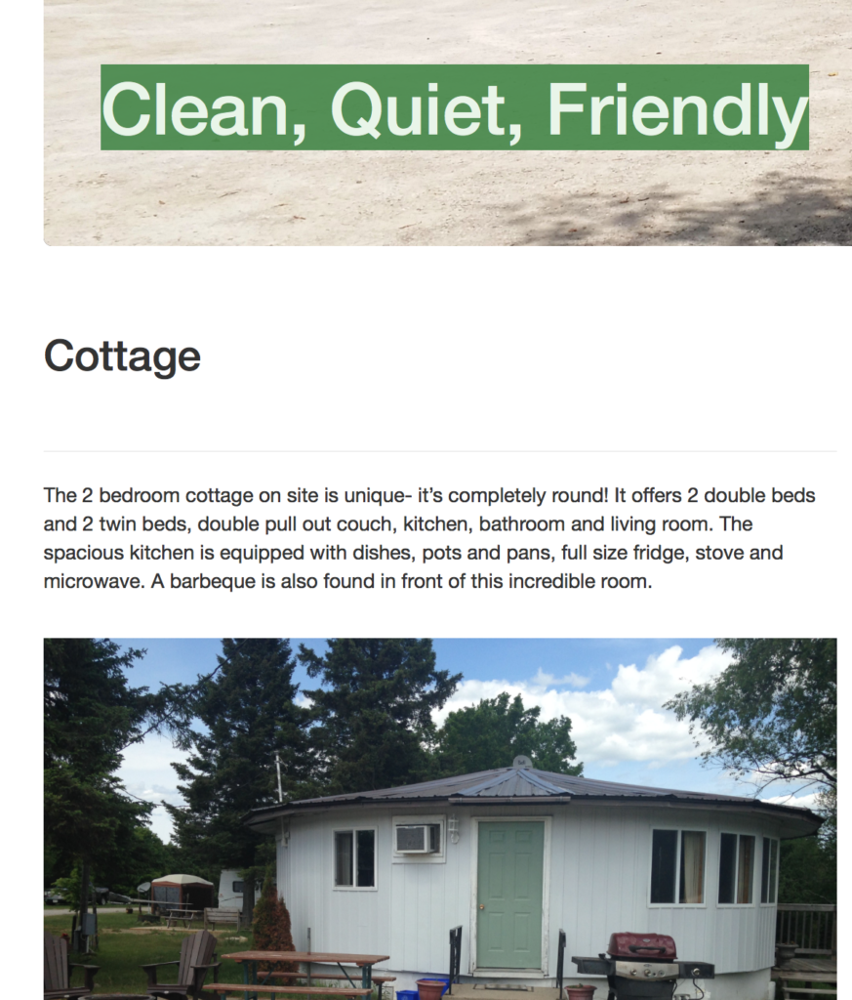
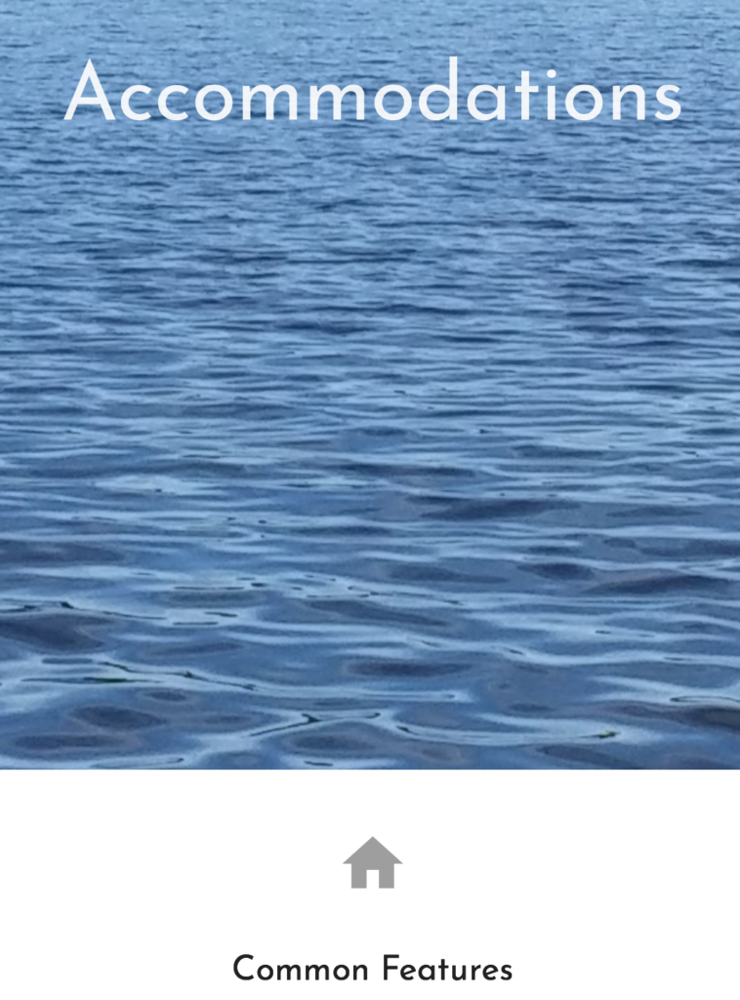
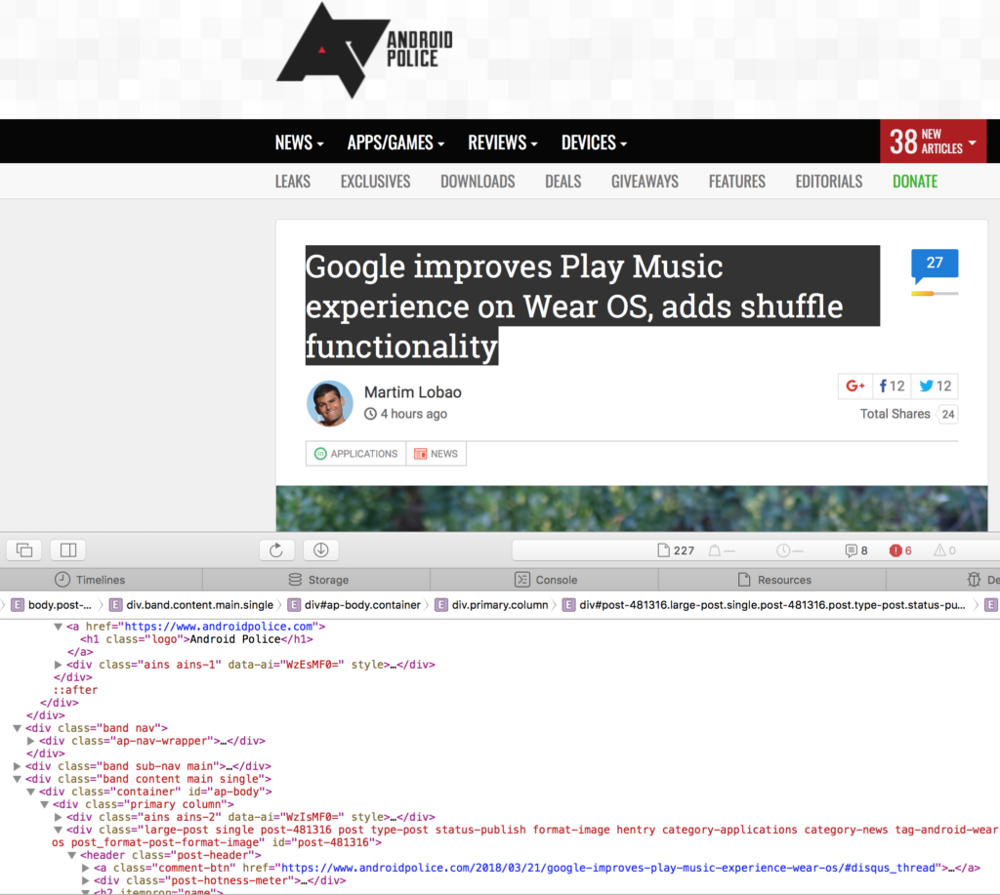
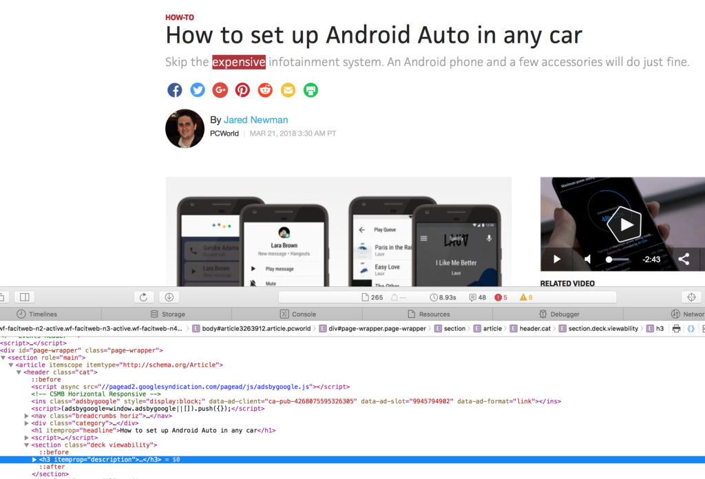
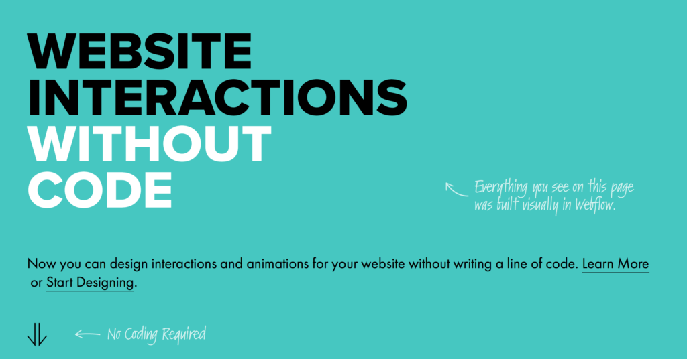

**This is a follow up to my previous [post](http://raygervais.ca/understanding-u11yn-concerns-relating-to-modern-flat-design-and-screen-readers/), describing some examples and public issues which touch upon heading semantics and color contrast.**

# Headings

## Admitting to Your Mistakes

### [South Wind Motel](www.southwindmotel.ca)

As you would have guessed, even I found the issues discussed above in past work from two websites which I used to claim where the best I was capable of at that time. Even more so, now that I know of these issues (which I discovered while looking for examples), the urge to fix and improve upon is there. In the South Wind Motel Website, I improperly used a H1 for the hero component, which would be fine had I made that hero display 'Accommodations' instead of a tagline. This is how the page reads to screen interpreters right now (without worrying in this example of divisional area tag sementatics):

\- H1:\`Clean, Quiet, Friendly.\`
	- H2: Cottage
		- P: ...
	- H2: RV
		- P: ...
	- H2: Room
		- P: ...
	- H2: Camping
		- P: ...

\[caption id="attachment\_750" align="alignnone" width="792"\] South Wind Motel Heading Mistake\[/caption\]

This may look like a minor issue, but the pattern repeats on each page with different taglines, some often not granting proper title-like context such as [Property](http://southwindmotel.ca/property.html) or [Trail](http://southwindmotel.ca/trail.html), which become increasingly more vague. Still, you have to start somewhere I suppose.

### [Silver Maple Motel](http://silvermaplemotel.ca/)

A website done a year after South Wind's was finished (which was a weekend project during Christmas break in my defence), Silver Maple corrected many of the layout and 'aesthetic' issues I had with South Wind's. In doing so, I created a different pattern of heading misuse. Here are the obvious ones that a simple inspect element unveils:

- I used H1s due to their styling and size as icons. Meaning every standard icon on the page is a H1, without text or proper hierarchy in the slightest.
- The proper titles use H5, unsure why I went so low down the spectrum, but we jump from an icon of H1 to H5 titles
- The parallax images and their respective titles are H3s, which really should be H1s since they define the separation of page contents and topics. Likewise there is inconsistent blurring in attempt to mitigate contrast issues which I'll discuss in a later article.

## Two Examples of Similar Common Mistakes in the Wild

### [AndroidPolice](www.androidpolice.com)

I love this website, it has been my goto source of news for all things Android since 2011, and I have to this day always held high regard for the content and it's writers who publish there. While inspecting the site, I only saw one major offence (in my opinion, I could be forgetting a rule since there are so many) when it came to header use. The navigation bar uses a H1 for the \`AndroidPolice\` logo, and the article titles start at H2. This means that ever page is interpreted this way:

\- H1: AndroidPolice
	- H2: Article Title
		- P: ...

\[caption id="attachment\_753" align="alignnone" width="792"\] Android Police Headings Mistake\[/caption\]

This may be a very minor issue, perhaps not an issue at all (depending on the ruleset, I am in no mood to read through the documentation this year just to confirm the smallest, most minute of a detail with a overall non-offending site), but I found it interested in how headings were used to imply hierarchy directly from the site's title.

### [PC World](www.pcworld.com)

Simply put from a quick inspection of an article (I imagine said patterns are throughout, since all CMS use templates to remove the grunt work): H1 for title (great!), H3 for subtitle / annotation.... not so great. Realistically, the guidelines do not imply a need for subtitles to have a heading, and I imagine this was used to leverage the H3s styling. Kudos for following expected heading semantics otherwise, every other title falls under the H2 use, making the page be interpreted in the following way:

\- H1: Title
    - H3: Subtitle (SO CLOSE!)
	- H2: Topic A
		- P: ...
	- H2: Topic B
		- P: ...

\[caption id="attachment\_755" align="alignnone" width="792"\] PC World Headings Mistake\[/caption\]

# Color Contrast

I decided to take a stroll through Modern Flat Web designs, and see if I could find any practice which was an instant red flag. I'm using https://speckyboy.com/flat-web-design/ which currates 50 'Perfect' examples of modern web design, a perfect list to try and pick a few apart. Will I succeed? Read on!

## [Design Interactions without Code](http://interactions.webflow.com/)

\[caption id="attachment\_756" align="alignnone" width="792"\] Website Interactions Without Code Color Contrast Mistake\[/caption\]

Damn that's a bright hero component, it's eye catching and yet blinding at the same time. The hero's text is very readable, until you notice the cursive text which I almost missed the first time glancing through. It's the same #FFFFFF as the bigger text, so how did I glance it over so quickly? How did it not catch my gaze? Well because the contrast ratio of that specific background color (#3EC7C2) and the text (#FFFFFF 29px font size) is 2.07:1, which fails both WCAG AA, and WCAG AAA demands. For large text, the ratio must be 3:1 or greater, which this one still does not comply with. Not off to a great start from the first page alone, and the contrast compliance didn't improve throughout the page either for most of the colorful elements. Sad, and we just began.

## [CraftsmanAvenue](http://craftsmanave.com/v2/)

Funnily enough, the design and overall approach here is much more subtle and well established. I decided to test the mission statement found at the top, which has a text color of #887771 and a background page color of #FAF7F6, together they form a contrast ratio of 4.00:1, so close. Many of the elements are basic hues off from WCAG AA Color Contrast compliance, so I moved on, feeling hopeful.

## [Stash Flat Icons](http://stashflaticons.com/)

\[caption id="attachment\_760" align="alignnone" width="792"\] ....\[/caption\]

Presenting, modern \`aesthetic\`. Colors so close together in the spectrum that you don't need to test using a color ratio tool to identify compliance. I can barely read the list items, I dare you to without squinting. It was at this point that I decided we had a good assortment of color related examples which all could learn from.

# Learning from These Items

While doing writing this follow-up, I found two really helpful links for headings and HTML semantics which I’ve posted below. I think that if every front-end developer went through and truly understood, it wouldn’t take long at all to reprogram our already-logic-driven minds to the true semantic structuring of headings. I cannot say how we can improve these types of color contrast issues, aside from being mindful and questioning if aesthetic such as flat demands such low contrast elements beside one another. Even in enterprise, it’s not unheard of for design to be beautiful, but inaccessible to many.

https://mrwweb.com/use-html-headings-for-accessibility/ https://mrwweb.com/common-heading-mistakes/
