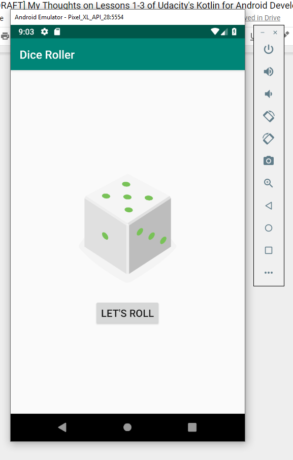
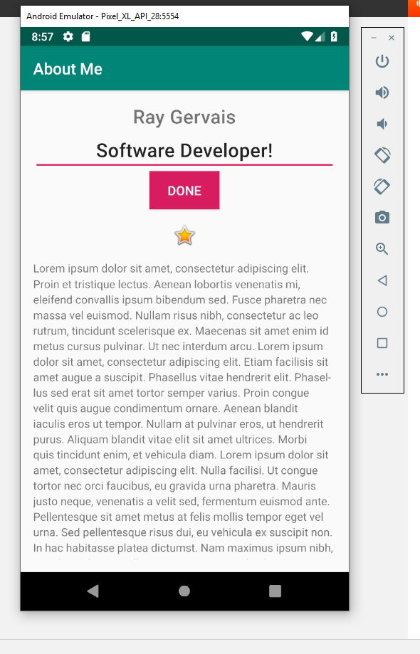
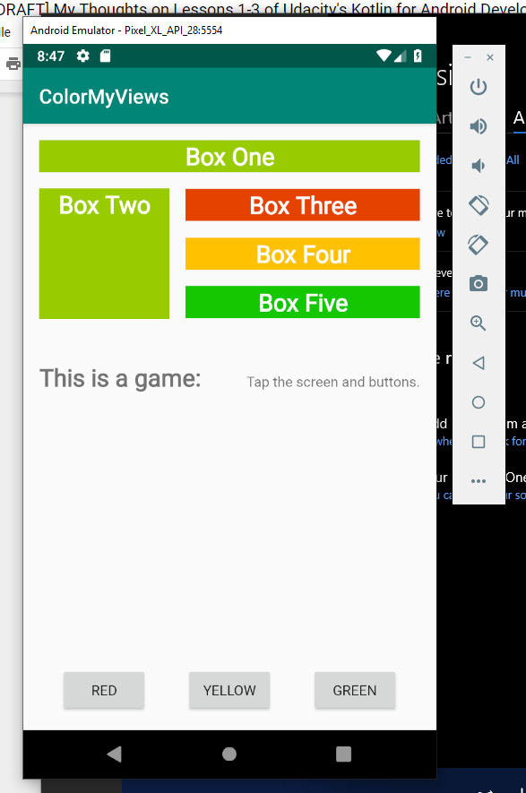
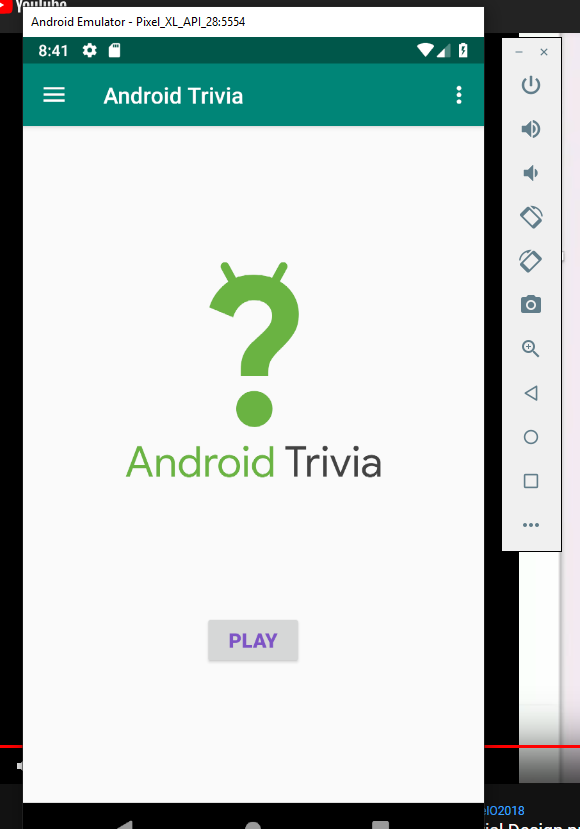

**Lessons 1-3**

For 2019, one of my goals was to complete the Google/Udacity Kotlin for Android Development course. I wrote more about why over here [https://raygervais.ca/starting-2019-with-a-retrospective/](https://raygervais.ca/starting-2019-with-a-retrospective/)!

Since starting on the first, I’ve completed the first three `lessons` of ten in the course (sadly, it appears that they are still working on content for lessons five to ten, and have not published the work for them), so I thought I’d give my initial feedback and also thoughts on the course’s primary focus: developing Android applications using Kotlin.  Digging into the unfinished courses does provide the video files, so it’s possible to learn some of Lesson’s 5-10 on my own without the quizzes or sample code.

_Anyways, for those who want to follow along:_ [_https://github.com/raygervais/kotlin-for-android-course_](https://github.com/raygervais/kotlin-for-android-course)_, and now for some thoughts!_

## Lesson 1

### Dice Roll (Intro)

Dice Roll

This was a basic introduction to Android application development using Kotlin, so if you had taken any previous course prior then nothing should be a surprise in this lesson. Still, one key item that this lesson taught was some of the major workflow enhancements which are enabled by Kotlin compared to the older Java paradigms. Still, I got a cool dice-rolling application out of it while also learning more Kotlin powered strategies including no longer needed to call _findViewById_(). Thank God.

## Lesson 2

This lesson was split into two, as you can see I am quite fond of the first section, and not so much of the second.

### Data Binding

About Me

Having understood the basics of Android development from a Seneca course (done in Java), the first lesson was a good refresher. This one on the other hand, this lesson on data binding using modern Kotlin modules felt like the natural extension of what I also employed in iOS using Swift Object Models and _UIViews_. This lesson brought the concept of Android Development tooling and workflows one step closer to being on par with iOS development, and removing of one nagging item which I fought with endlessly while working on a Java application.

The example is simple enough, and still loaded with enough descriptions of how and why data binding in Android is implemented in such a way that you can pick up the material and easily apply it to your current project. It transitions older development methodologies to more modern design practices which I really appreciate, since you can now bind ViewModel  and _VIPER_ architectures much cleaner than having the object instance and detail view (for example) unaware of their contexts with each other.

### Constraint Layout

This tutorial for constraint layout was more of a chore to go through. Though informative and useful for those learning the layout, the actual lesson pacing and end-product left a lot to be desired. I found the last bits of real code (instead of focusing on XML layouts for the other ninety percent) to be the most useful, since it displayed functional programming logic with UI Element Ids. Still, for those working on pixel-perfect designs and specific UI chaining of elements, this would be a good resource to consult.

## Lesson 3

### Fragments & Navigation Architecture

Fragments are hard. I think between all the various high and low level topics that I learnt at Seneca relating to Android, Fragments and View life-cycles were components which completely escaped me so much that I ended up writing my final project using only intents -we were instructed to utilize fragments as much as possible. Yet, with the newly released Navigation Controller and Navigation Graph (ala Google I/O 2018), fragment development seems much less daunting and again, comparable to the experience on iOS with Storyboards. Having no prior experience developing with Fragments, I can assume that this is closer if not better than what some claim third-party libraries have provided in attempts to better handle the Android View components.

Having gone through all twenty-nine steps in this lesson, I can say that there is a lot of valuable tutorials here; enough to cover a chapter or few even. It goes through the multiple new API’s released this past year and how to utilize both the native ones alongside developer friendly libraries such as _KTX_ (Kotlin Extensions) which make the already less-verbose language (compared to Java) even more to the point. I love the _NavigationDirections_ API built into _NavigationControllerUI_, and how easily Fragments are now developed and handled.

Upon completing the third lesson, you are presented with a modern application which (in my opinion) you can be proud of having created. It’s very basic, but for someone who never understood Fragments or View components this is like leaping over the wall which you previously didn’t know was only so tall. I also learned that the world of mobile application development is so much more vast than I anticipated API wise, so a good snippet manager is critical if you don’t want to review all the previous code bases you wrote! Currently exploring the open source snippet manager (which works with your GitHub Gists) Lepton: [https://github.com/hackjutsu/Lepton](https://github.com/hackjutsu/Lepton).

Perhaps something on that in the future?

Course Link: https://www.udacity.com/course/developing-android-apps-with-kotlin--ud9012
