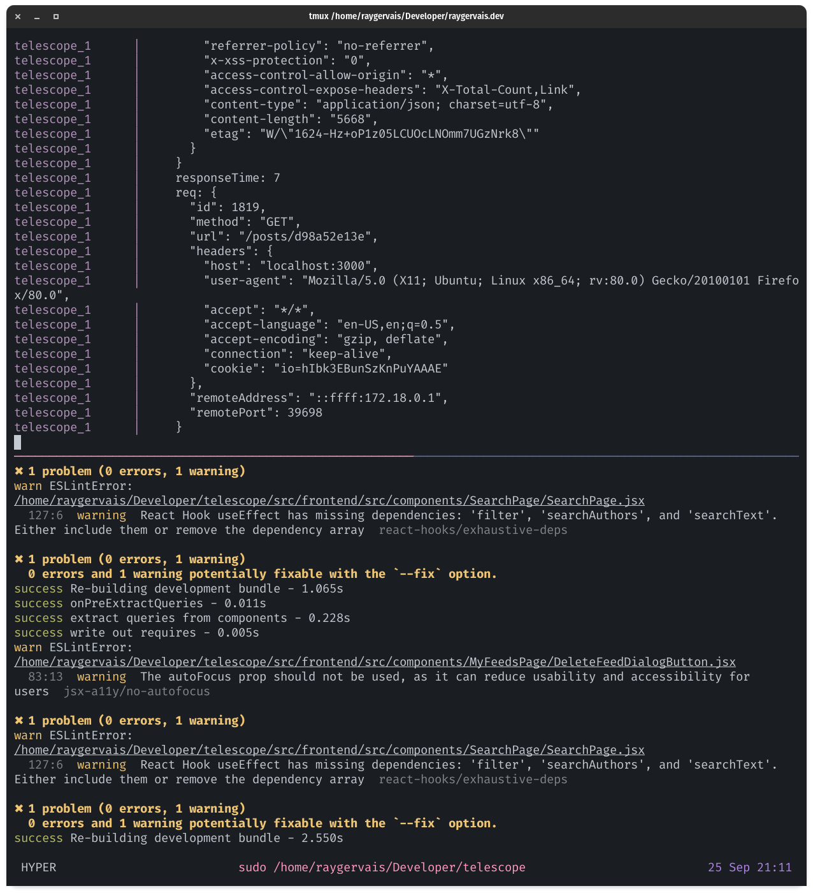
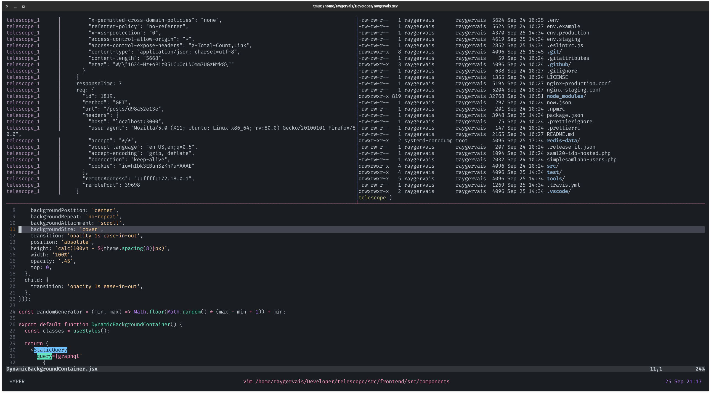

_Or, How To Look Like A Hacker at Starbucks_

I've long been inspired by the often beautiful -yet vastly nonfunctional- desktop setups found on /r/UnixPorn and other Linux-based forums. Often, _starterpacks_ describe a aesthetic and futuristic configuration to comprise of `Arch Linux` , `i3-gaps` , terminal-based interfaces, and `Vim` . The terminal applications have intrigued me for as long as I've been a developer, -the bias being that the terminal will always be faster than GUI-based interfaces and processes. In some workflows, I 100% agree and wanted to explore how far I could get -since, majority of my recent career has revolved around editing code and configuration more-so than writing it.


Terminal applications have intrigued me for as long as I've been a developer, -the bias being that the terminal will always be faster than GUI-based interfaces and processes. In some workflows, I 100% agree and wanted to explore how far I could get. This experiment would expand to not just my personal laptops and desktop setups, but also my development workflow while working! -No- Some pressure, that's for sure. The real reason why I want to explore is also to reduce the amount of context switching which results in dozens of terminal tabs being open and forgotten about over the course of the day. Instead, I can dynamically creating and closing as I need on a single pane.

For this experiment, I'm going to be using Fish as my Shell, Alacritty for my Terminal emulator, Tmux for session/pane management and Vim as my text editor. Let's get started with the Shell. I find Fish to be faster thanks to it's autocompletion, hinting and prompt customizations compared to BASH; it fits in perfectly with my terminal-centric goals. Once installed via your standard repository, some customizations I had made including adding the following functions:

| Function | Implementation       | Reasoning                                                                                                      |
| -------- | -------------------- | -------------------------------------------------------------------------------------------------------------- |
| cdev     | `cd ~/Developer/` | I end up doing `cd ~/devel` (or similar) quite often, why not make a shortcut?                                 |
| gpm      | `git checkout master && git pull master` | For when you're working in a git repository and want to grab the latest changes from master. Which I do daily. |
| gpo      | `git push origin $@` | For when you're really lazy and just want to do a `git push origin` with your branch                           |

## Vim

It goes without saying, that I have a love/hate relationship with this iconic editor. When SSH'ed into a machine, connected to a Docker container or debugging pipelines, my goto tool has always been Vim for both editing and going through files. Every week, I learn something new -often by accident- that improves my workflow and draws awe from others. Did you know with `wc` , you can replace an entire word without having to delete it first and be dropped straight into insert mode? I really should do Vimtutor at some point! Plus, isn't it always grand to be apart of a topic which drives holy-war levels of argument and fragmentation among developers? Don't get me started on the Nano advocates _coughs_ Ali _coughs_.

## Alacritty

GPU-accelerated terminal emulator. I would never have thought of such an application description last year, and then I discovered the open source project Alacritty. The idea didn't make sense to me at first, but after watching [DistroTube](https://www.youtube.com/watch?v=PZPMvTvUf1Y)'s overview and explanation of what makes Alacritty so fast I had to test it myself. Installing is simple via `apt` , or your preferred package manager of choice and all can be configured via the `alacritty.yaml` file found often in your home directory. From there, it was a matter of putting the terminal through it's paces if I were to deem it an asset for the terminal-driven experiment -after all, the terminal is quite the most important aspect to this. Oddly enough, even after testing similar to Derek with `ls -laR` on my root and being impressed at the fluidity on both my five-year old Dell XPS and newer Desktop setup, it was the fluidity and responsiveness of editing in Vim where I truly notice the smoothness. I'm an odd one, I know.

For those curious, I've included my (initial) Alacritty configuration file which I customized to leverage the following so far:

* Fira Code as my primary font
* Fish Shell
* Inksea Dark color theme (more on that below)
* 12dp padding for both X and Y

So, we have our terminal, but what will it house?

## Tmux

Well, I know what Alacritty won't natively house, tabs. Alacritty's developers have answered time and time again that similar to many other niche softwares, it won't support common feature-sets such as terminal tabs. This means if I wanted to have multiple instances open within the same Alacritty instance, I'd have to dive into the often coveted software: tmux! Their Github repo defines the project as, `tmux is a terminal multiplexer. It lets you switch easily between several programs in one terminal, detach them (they keep running in the background) and reattach them to a different terminal.` The most captivating feature for me coming from an avid user of `screen` while in terminal-based sessions was the ability to detach and reattach different contexts with ease.

I think what truly drove this experiment was discovering Ham Vocke's [blog post](https://www.hamvocke.com/blog/a-guide-to-customizing-your-tmux-conf/) on (in my opinion) his sane tmux configuration, which includes vim-style navigation (far more intuitive in my opinion), mouse support between panels, and changing the god-awful prefix to `Ctl+a` . Switching to those configurations along with others I discovered while exploring the interwebs have led to a fantastic experience. Sensible defaults really do make/break a tool or program.

```bash
# Based on https://www.barbarianmeetscoding.com/blog/2019/12/25/jaimes-guide-to-tmux-the-most-awesome-tool-you-didnt-know-you-needed

# Default Shell
set-option -g default-shell /usr/bin/fish

# Increase scroll-back history
set -g history-limit 5000

# Use vim key bindings
setw -g mode-keys vi

# Decrease command delay
set -sg escape-time 1

# Set Tmux Prefix to Ctl+a
unbind C-b
set -g prefix C-a
bind C-a send-prefix

# Enable Mouse
set -g mouse on

# Reload Config
unbind r
bind r source-file ~/.tmux.conf \; display "Reloaded tmux config!"

# Panes Window Splitting
unbind %
bind | split-window -h
unbind '"'
bind - split-window -v

# Vim Switch Panes
bind h select-pane -L
bind j select-pane -D
bind k select-pane -U
bind l select-pane -R

#####################
# Status Bar
#####################

# Enable UTF-8 Support
set -gq status-utf8 on

# Center Status Bar
set -g status-justify centre

######################
# Colors
######################

# Based on Inksea VSCode Theme
# https://github.com/inksea/inksea-theme/blob/master/src/inksea-dark.yml

# Syntax Highlighting for MacOS, Linux, and WSL
# https://github.com/tmux/tmux/issues/699#issuecomment-595673763

set -g default-terminal "screen-256color"
set -ga terminal-overrides ",xterm-256color:Tc"
set -g default-terminal "screen.xterm-256color"

# Pane border
set -g pane-border-style fg='#6272a4'
set -g pane-active-border-style fg='#FF9AC1'

# Message Style
set -g message-style bg='#1a1d21',fg='#c4cad1'

# Status Style
set -g status-style bg='#1a1d21',fg='#c4cad1'

# window status
set-window-option -g window-status-style fg='#c4cad1',bg='#1a1d21'
set-window-option -g window-status-current-style fg='#ff79c6',bg='#282a36'

# Status Left
set -g status-left '#{?client_prefix,#[fg=#6FC1FF],} HYPER '

# Status Window
set-window-option -g window-status-style fg='#c4cad1',bg=default
set-window-option -g window-status-current-style fg='#FF9AC1',bg='#282a36'
set -g window-status-current-format "#[fg=#FF9AC1]#[bg=#1a1d21] #T"

# Status Right
set -g status-right '#[fg=#B084EB] %d %b %R '

# update status bar info
set -g status-interval 60
```



Now, with a simple `tmux a -t dev` , I can resume my previous coding session or start a brand new one with `tmux new-session` , and then go about opening panes as I need with `Ctl+a -` or `Ctl+a |` , switching with either mouse focus or the leader key and Vim navigation. Is this my first unknowing stroke into unknown waters defined as 'tiling windows managers'? Will I, months from now come to admit the speed and productivity that such a workflow can provide at the cost of both sanity and anyone else ever looking at me the same way again? I digress. The last item I wanted to address to complete the experience is the overall aesthetic.

## Color Theme

Similar to `/r/unixporn` , I too have found a comfort in having a shared aesthetic and color scheme among all my applications and interfaces -I imagine it's why Apple is revered in the design world, since iOS and MacOS often follow each other in tandem as they share UI elements and interface semantics. I often achieve some semblance of this when on Linux (more often compared to Windows) thanks to GTK or QT themeing, or MacOS with native applications. My favorite Gnome theme which embodies much of the color choices I enjoy is `Orchis` , or on the KDE front, `Layan` . `Dracula` for both Gnome and KDE do look quite appetizing, and more-so is available everywhere on almost any application which supports theming. But, this post is on terminal-based interfaces so let's focus.

Dracula themes can be found for Alacritty, Fish, tmux, and vim; so that's what I set up. On vim, I found the semantic highlighting color choices to be hit or miss depending on language which created a rather janky experience at times. Maybe I'm being picky, but the bright colors I also didn't jive with as much as I thought I would. It's great in VSCode on my MacBooks (oddly enough), but when open in Linux or VS Code the colors just look like a rainbow exploded with yellows and purples all over the place. So, though I still run it on my MacBook, I opted to try a different approach: port over a recent VSCode theme that I've been using on my non-MacOS systems: inksea dark.



This is the first time I've ever ported a theme over to vim, and with that I'm sure there's far cleaner / easier ways to do so. In my case, I went about modifying the Dracula theme to utilize inksea colors. After digging through the dracula theme and discovering `/.vim/bundle/dracula/autoload/dracula.vim` housed the theme colors. Replacing the colors with the inksea colors provided a fantastic base (which you can see in my [dotfiles](https://github.com/raygervais/dotfiles) repository) to start with. From there, updating tmux and alacritty was as simple as modifying their respective dotfiles with the new color scheme and preferences. Both of which can be found in my dotfiles repo as well!

# Resources

* [Cover Image: Photo by Kilyan Sockalingum on Unsplash ](https://unsplash.com/photos/8NH2_f5TxAA)
* [Ham's Tmux Configuration](https://www.hamvocke.com/blog/a-guide-to-customizing-your-tmux-conf/)
* [Jaime's Guide to the Most Awesome Tmux Configuration](https://www.barbarianmeetscoding.com/blog/2019/12/25/jaimes-guide-to-tmux-the-most-awesome-tool-you-didnt-know-you-needed)
* [UnixPorn Starter Pack](https://www.reddit.com/r/starterpacks/comments/9qjrm1/runixporn_starter_pack/)
* [UnixPorn Subreddit](https://www.reddit.com/r/unixporn/)
* [Fish Shell](https://fishshell.com/)
* [Alacritty](https://github.com/alacritty/alacritty)
* [Tmux](https://github.com/tmux/tmux/wiki)
* [Vim](https://www.vim.org/)
* [dotfiles](https://github.com/raygervais/dotfiles)
